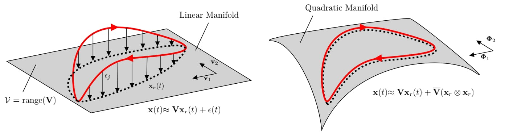

# Nonlinear Model Order Reduction of Power Grid Networks using Quadratic Manifolds

**Authors:** Farhana Farooq, Danish Rafiq  
**Date:** November 19, 2025

This repository contains the code and materials to reproduce the results in the manuscript
**"Nonlinear Model Order Reduction of Power Grid Networks using Quadratic Manifolds"**.  


---

## Repository structure
<pre>
├── figures  
├── paper.pdf  
├── case_studies/  
│   ├── case118_3phase_fault.m  
│   ├── case118_generator_outage.m  
│   ├── case118_unfaulted.m  
│   ├── case300_unfaulted.m  
│   └── polish2736_unfaulted.m  
├── src/  
|   ├── data/  
|   ├── functions/
|   ├── models/
|   └── solver/  
</pre>

---

## Requirements / Dependencies

- **MATPOWER** (for test system data and power flow): recommended v6.x.  
- Standard MATLAB toolboxes: *none strictly required beyond base and linear algebra*; if using advanced solvers you may need the Optimization Toolbox.  


> Note: the manuscript lists simulation details and solver choices (implicit Euler was used for experiments). See paper for exact parameters and reported CPU times.  

---

## Quick start — reproduce core experiments

1. **Place MATPOWER case files** in `data/matpower_cases/` (e.g., `case118.m`, `case300.m`, Polish case).  [already done]
2. Open MATLAB and add repo to path:
```matlab
addpath(genpath('code'));
addpath('data/matpower_cases');
```
3. Run any case-study e.g.,  case118_unfaulted.m

---
📚 References
1. Geelen, R., Wright, S. and Willcox, K., 2023. Operator inference for non-intrusive model reduction with quadratic manifolds. Computer Methods in Applied Mechanics and Engineering, 403, p.115717.
2. Takashi Nishikawa & Adilson Motter, Comparative Analysis of Existing Models for Power-Grid Synchronization, Proceedings of the National Academy of Sciences (PNAS), 2015.


